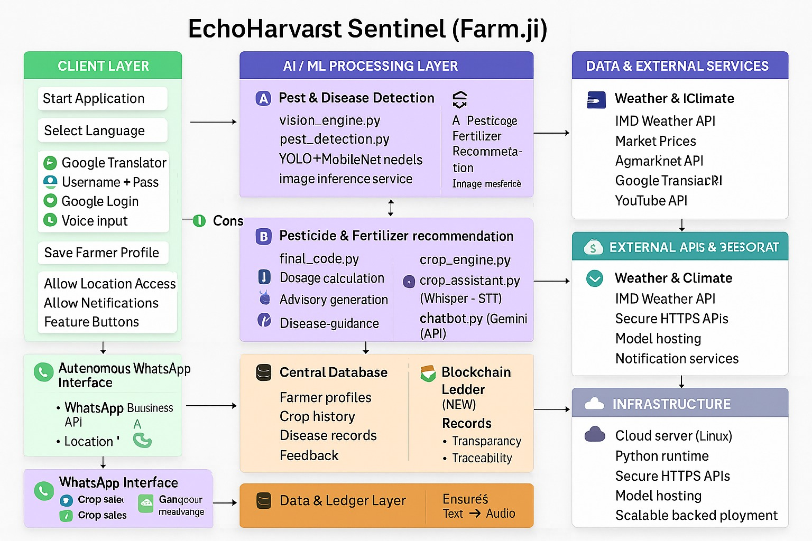
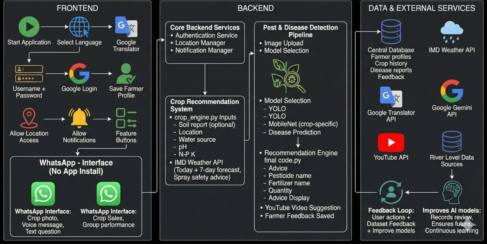

#  Kisan.JI - Smart Agriculture Platform   (deployed on vercel live link ---->>> https://kisanji-frontend.vercel.app )

### Explainatory video link---->  https://youtu.be/ETIP463LaVk?si=M5DlUlwCZ6KcZCZz

### 📊 Database Schema Design---->  [View Database Schema](https://drive.google.com/file/d/1XOMa5s7_Mx0_X0nSupDs70ZFKi4kaB4u/view?usp=sharing)

Team Name: Kedari
Event: Hack The Winter.
University: Graphic Era Hill University, Dehradun

---

## 👥 Team Members & Contributions

| Team Member | Role | Key Contributions | Individual Repo |
|-------------|------|-------------------|-----------------|
| **Rajat Pundir** [@Rajatpundir7](https://github.com/Rajatpundir7) | Full Stack Developer & DB Architect | GNN Alert System, Weather Alerts, Database Schema, n8n Automation, WhatsApp Integration (50%) | [🔗 kisanji](https://github.com/Rajatpundir7/kisanji) |
| **Saurav Beri** [@rydhmm](https://github.com/rydhmm) | Backend Developer | FastAPI Backend, Fertilizer Calculator, Pesticide Calculator, Translation Service | [🔗 kisanji-project](https://github.com/rydhmm/kisanji-project) |
| **Ankit Negi** [@anku251](https://github.com/anku251) | AI/ML Engineer | Pest Detection Models, Crop Recommender, Voice Assistant, TTS, Gemini Integration | [🔗 kisan_jii](https://github.com/anku251/kisan_jii) |
| **Devesh Singh** [@Devesh-Singh-Gouni](https://github.com/Devesh-Singh-Gouni) | Full Stack Developer | Ganga River Flood Alert System, Real-time Monitoring Dashboard | [🔗 Pridict-River-Disaster](https://github.com/Devesh-Singh-Gouni/Pridict-River-Disaster--ganga-river-) |

### 📚 Documentation
- 📄 **[Team Contributions](docs/TEAM_CONTRIBUTIONS.md)** - Detailed breakdown of each member's work
- 📄 **[Flood Alert System](docs/FLOOD_ALERT_SYSTEM.md)** - Ganga River monitoring documentation
- 📄 **[n8n & WhatsApp Automation](docs/N8N_WHATSAPP_AUTOMATION.md)** - Workflow automation & WhatsApp integration

---

(Kisan.JI) is an AI-powered, mobile-first "village nervous system" designed to empower smallholder farmers. Addressing the critical issues of crop loss and market exploitation, our solution acts as a bridge between advanced agricultural science and the rural farmer.Current Status: This is a fully functional prototype featuring a Python backend, HTML/CSS/JS frontend, and optimized ONNX-based deep learning models for fast, lightweight inference.

  
  **AI-Powered Agricultural Assistant for Indian Farmers**
  


---

### Application Flow & Architecture ###
##  System Architecture
<p align="center">
  
</p>

##  Application Flowchart
<h2 align="center"> Application Flowchart</h2>
<p align="center">
  
</p>

    
##  Features---

###  AI-Powered Assistant
- **Gemini AI Integration** - Smart chatbot for farming queries
- **Voice Assistant** - Multilingual voice support (Hindi, Marathi, Tamil, Telugu, etc.)
- **Text-to-Speech** - Audio responses in regional languages

###  Crop Management
- **Disease Detection** - ONNX model-based plant disease identification(plant_doctor.pt, corn_mobile_v2.onnx, sugarcane_mobile_v2.onnx,  wheat_mobile_v2.onnx, rice_mobile_v2.onnx, cotton_mobile_v2.onnx)
- Workflow: Image Input → ONNX Runtime Inference → Disease
- **Pest Detection** - YOLOv8-powered pest identification
- **Crop Recommendation** - Powered by a trained Random Forest model (crop_recommender.pkl).
•	Inputs: Nitrogen (N), Phosphorus (P), Potassium (K), pH Level, Rainfall, and Water Source (Tubewell/Borewell vs. Rain).
•	Logic: Correlates soil nutrients with IMD weather data to suggest the highest-yield crop for the specific season.

###  Market Intelligence
- **Live Mandi Prices** - Real-time market prices from eNAM API
- **Weather Forecasts** - OpenWeatherMap integration with farming alerts
- **Price Trends** - Historical price analysis

###  Farm Tools
- **Fertilizer Calculator** - NPK-based fertilizer recommendations
- **Pesticide Calculator** - Safe dosage calculations
- **Spray Scheduling** - Weather-aware spray timing

###  Smart Alerts
- **GNN-Based Network** - Graph Neural Network for farmer alert propagation
- **Weather Alerts** - Frost, rain, and extreme weather warnings
- **Disease Outbreak Alerts** - Community-wide disease notifications

###  Government Schemes
- **PM-KISAN** - Direct benefit information
- **Crop Insurance** - PMFBY scheme details
- **Subsidies** - State-wise subsidy information

### Database Schema (Backend) 
•	users (Role, Language, Voice_Enabled)
•	farmer_profile (Land Size, Soil Type, Irrigation)
•	disease_results (Image ID, Confidence, Severity)
•	market_prices (Mandi Name, Price/Quintal)
•	schemes & scheme_notifications (Govt Subsidies)

### Disease Encyclopedia 
Beyond detection, the app serves as an educational library. We have categorized thousands of images into structured datasets for manual lookup:
•	Categories: Fungicides, Bacterial Effects, Insecticides.
•	Coverage: Apple, Gram, Sugarcane, Wheat, Rice, Cotton, and 20+ other major Indian crops.


## Planned Improvements (Round 2)
### 1. Ganga Alerts (Flood & Water Safety) - *By Devesh Singh*
•	Objective: To directly address climate uncertainty.
•	Status: ✅ **Implemented** - Real-time flood monitoring for 8 cities along Ganga River
•	Features: Traffic light indicators, population impact data, region filtering
📄 **[Flood Alert Documentation →](docs/FLOOD_ALERT_SYSTEM.md)**

#### 2. Autonomous WhatsApp Agent (Business API) - *By Rajat Pundir*
•	Objective: To remove the barrier of app installation.
•	Status: 🔄 **50% Complete** - n8n workflows + WhatsApp webhook integration
•	Completed: Text queries, voice messages, webhook setup
•	In Progress: Image-based disease detection via WhatsApp
📄 **[n8n & WhatsApp Documentation →](docs/N8N_WHATSAPP_AUTOMATION.md)**

### 3. Blockchain Supply Chain
•	Objective: To validate the "Company Buyer Listing" feature.
•	Plan: A transparent ledger to record transactions between farmers and corporate buyers, ensuring fair payments and traceability.

---

## 👨‍💻 Individual Contributions Detail

<details>
<summary><b>🔵 Rajat Pundir - Full Stack Developer & Database Architect</b></summary>

### Core Features Developed:
- **GNN-Based Network Alert System**: Graph Neural Network for farmer alert propagation
- **Weather Alerts Module**: Real-time frost, rain, extreme weather warnings
- **Disease Outbreak Notifications**: Community-wide disease alerts with image detection
- **Government Schemes Integration**: PM-KISAN, PMFBY, State Subsidies
- **n8n Workflow Automation**: Automated disease detection, weather, market workflows
- **WhatsApp Business API**: Text/voice query handling (50% complete)

### Database Schema (11 Tables):
| Table | Purpose |
|-------|---------|
| users | Farmer profiles & preferences |
| farmer_profile | Land, soil, irrigation details |
| disease_results | AI detection results |
| market_prices | Real-time mandi rates |
| schemes | Government programs |
| weather_data | Location forecasts |

### Files:
`farmer_alert_network.py` • `alert_service.py` • `AgriGraph_Optimizer/`
</details>

<details>
<summary><b>🟢 Saurav Beri - Backend Developer</b></summary>

### Core Features Developed:
- **Backend Architecture**: FastAPI & Flask server setup
- **Fertilizer Calculator**: NPK-based recommendations for 100+ crops
- **Pesticide Calculator**: Safe dosage calculations for 99 pesticides
- **Translation Service**: Multilingual support with deep-translator
- **API Design**: Request-response flow, validation, modular organization

### Files:
`advanced_fertilizer_calculator.py` • `pesticide_calculator.py` • `backend.py` • `server.py` • `translation_service.py`
</details>

<details>
<summary><b>🟡 Ankit Negi - AI/ML Engineer</b></summary>

### Core Features Developed:
- **Pest Detection Models**: Crop-specific disease detection
  - `corn_mobile_v2.onnx` - Corn Blight, Rust
  - `cotton_disease_v2.onnx` - Cotton Bacterial Blight
  - `rice_mobile_v2.onnx` - Rice Blast, Tungro
  - `wheat_mobile_v2.onnx` - Wheat Rust
  - `plant_doctor.pt` - YOLOv8 leaf scanning
- **Crop Recommender**: ML model (N, P, K, pH analysis)
- **Voice Assistant**: Gemini API integration
- **TTS & STT**: XTTS voice synthesis, Whisper recognition

### Files:
`pest_detection.py` • `vision_engine.py` • `crop_engine.py` • `voice_assistant.py` • `agri_brain.py` • `universal_tts.py` • `voice_processor.py`
</details>

<details>
<summary><b>🔴 Devesh Singh - Full Stack Developer</b></summary>

### Core Feature: Ganga River Flood Alert System
- **Live Monitoring**: 8 cities (Varanasi, Patna, Haridwar, Prayagraj, Kanpur, Farakka, Rishikesh, Kolkata)
- **Visual Indicators**: 🔴 Danger | 🟠 Warning | 🟢 Safe
- **Features**: Region filtering, population impact, rainfall data
- **Tech Stack**: Django backend, Vanilla JavaScript frontend

📄 **[Documentation →](docs/FLOOD_ALERT_SYSTEM.md)**
</details>

---


##  Quick Start

### Prerequisites
- Node.js 18+ & npm
- Python 3.11+
- MongoDB Atlas account
- Google Gemini API key
- OpenWeatherMap API key

### Local Development

1. **Clone the repository**
```bash
git clone https://github.com/YOUR_USERNAME/kisanji.git
cd kisanji
```

2. **Setup Backend**
```bash
cd backend
pip install -r requirements.txt
cp .env.example .env
# Edit .env with your API keys
python server.py
```

3. **Setup Frontend**
```bash
cd frontend
npm install
npm start
```

4. **Access the app**
- Frontend: http://localhost:3000
- Backend API: http://localhost:8000/api
- API Docs: http://localhost:8000/docs

---

##  Deployment

### Backend (Render)

1. Create a new **Web Service** on [Render](https://render.com)
2. Connect your GitHub repository
3. Set the following:
   - **Root Directory**: `backend`
   - **Build Command**: `pip install -r requirements.txt`
   - **Start Command**: `uvicorn server:app --host 0.0.0.0 --port $PORT`
4. Add environment variables:
   - `MONGO_URL`: Your MongoDB Atlas connection string
   - `DB_NAME`: `echoharvest_db`
   - `GEMINI_API_KEY`: Your Google Gemini API key
   - `WEATHER_API_KEY`: Your OpenWeatherMap API key

### Frontend (Vercel)

1. Create a new project on [Vercel](https://vercel.com)
2. Connect your GitHub repository;
3. Set the following:
   - **Root Directory**: `frontend`
   - **Build Command**: `npm run build`
   - **Output Directory**: `build`
4. Add environment variable:
   - `REACT_APP_API_URL`: Your Render backend URL + `/api`
     (e.g., `https://kisanji-backend.onrender.com/api`)

---

##  Project Structure

```
kisanji/
├── backend/
│   ├── server.py           # FastAPI main server
│   ├── agri_brain.py       # Gemini AI integration
│   ├── vision_engine.py    # Disease detection
│   ├── alert_service.py    # GNN alert network
│   ├── crop_recommender.py # ML crop recommendations
│   └── requirements.txt
├── frontend/
│   ├── src/
│   │   ├── components/     # React components
│   │   ├── pages/          # Page components
│   │   ├── services/       # API service
│   │   └── contexts/       # React contexts
│   ├── public/
│   │   └── images/         # Background images
│   └── package.json
└── README.md
```

---

##  Environment Variables

### Backend (.env)
```env
MONGO_URL=mongodb+srv://...
DB_NAME=echoharvest_db
GEMINI_API_KEY=your_key
WEATHER_API_KEY=your_key
```

### Frontend (.env.local)
```env
REACT_APP_API_URL=http://localhost:8000/api
```


